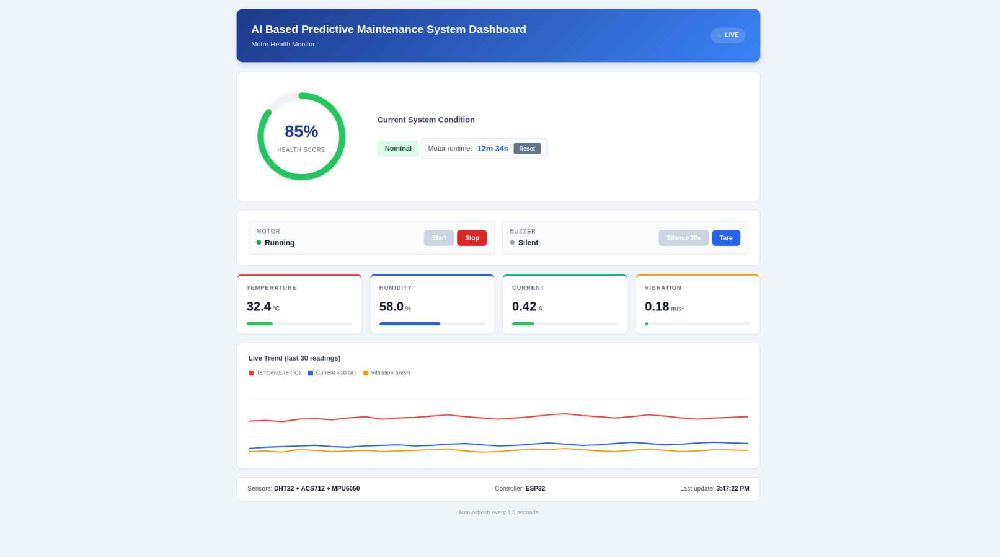
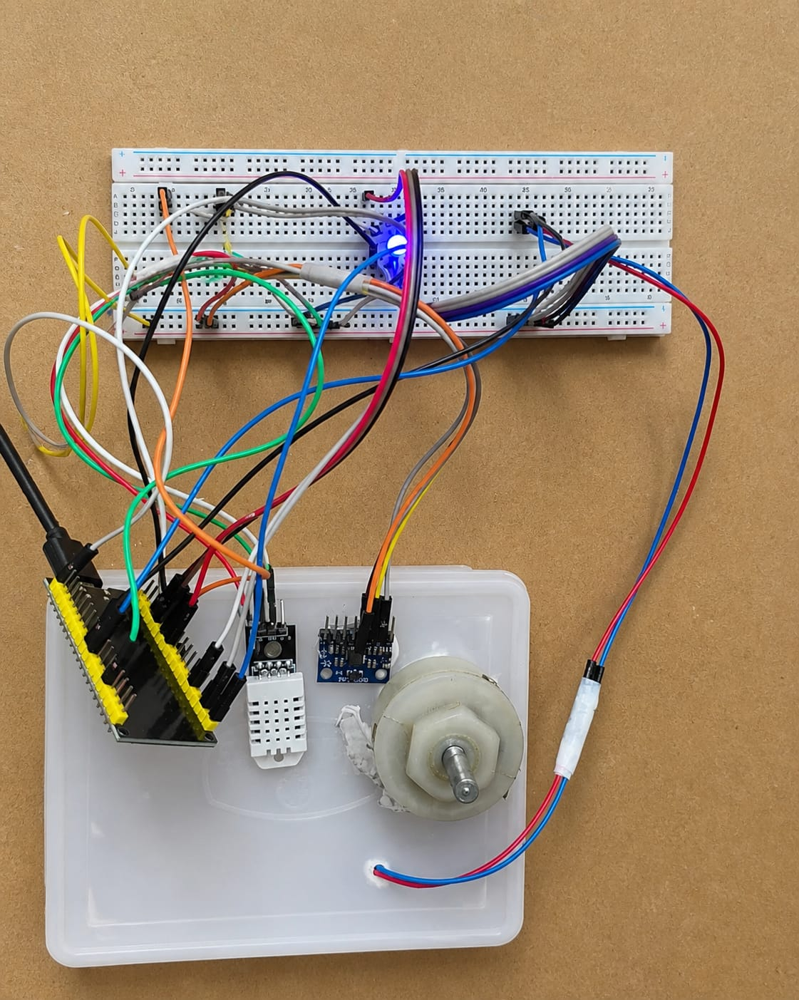

# IoT-Based Motor Health Monitoring

> **Fault Detection and Predictive Maintenance Prototype**

An embedded prototype of predictive maintenance for monitoring the operational condition of a DC gear motor by measurements of **temperature, humidity, electrical current and vibration**. An **ESP32** performs sensor acquisition and edge-side processing, computes a weighted motor-health score, exposes a lightweight HTTP dashboard over Wi-Fi, and drives visual/audible alerts when abnormal operating conditions are detected.

The system is a compact **Industry 4.0 / condition monitoring prototype** combining mechanical equipment monitoring, embedded systems, sensing, signal processing, fault thresholds and browser based interface.

---

## Project Overview

Electric motors are a critical component in industrial equipment, and failures caused by overheating, overload, excessive vibration, or abnormal electrical behaviour can result in downtime and maintenance costs.

In this project, a low-cost condition-monitoring architecture is demonstrated in which multiple sensors observe the motor simultaneously:
- **DHT22** -> motor/environment temperature and humidity
- **ACS712** -> motor current usage
- **MPU6050** -> vibration measurement (based on acceleration)
- **ESP32** -> sensor acquisition, processing, health scoring, control logic and web server
- **L298N** -> DC motor drive/control.
- **Buzzer + LEDs** -> local fault indication
- **Embedded Web Dashboard** -> remote real-time monitoring and motor control

The ESP32 processes the measurements locally and periodically publishes the current condition to a web dashboard. This allows the prototype to function as a **edge-computing condition-monitoring system**, without an additional backend server.

---

## Objectives

The project was created to demonstrate the following abilities:

1. Continuous health monitoring of a running motor based on multiple physical parameters.
2. Monitors abnormal operating conditions with user configurable thresholds.
3. **Motor Health Score from 0-100** consolidate several indicators into a single score.
4. Deliver local alarms immediately on detection of critical conditions.
5. Provide an operator web interface to start/stop the motor and handle alerts.
6. Monitor motor run time for maintenance scheduling.
7. Provide an extensible basis for future cloud analytics, historical data logging and machine learning based failure prediction.

---

## Key Features

### Real-Time Multi-Parameter Monitoring

The system continuously acquires:

| Parameter | Sensor | Purpose |
|---|---|---|
| Temperature | DHT22 | Detect thermal stress / overheating |
| Humidity | DHT22 | Environmental monitoring |
| Current | ACS712 | Detect abnormal electrical load/current draw |
| Vibration | MPU6050 | Detect excessive mechanical vibration |
| Runtime | ESP32 timer | Track operating duration |

The dashboard refreshes approximately every **1.5 seconds**.

---

### Motor Health Score

A composite health score is calculated locally on the ESP32.

The current implementation converts temperature, current, and vibration into normalized stress values and combines them using the following weights:

\[
\text{Stress} =
0.50(\text{Temperature Stress}) +
0.25(\text{Current Stress}) +
0.25(\text{Vibration Stress})
\]

\[
\text{Health Score} = 100 - \text{Stress}
\]

The resulting value is constrained to the range **0–100**.

### Health interpretation

| Health Score | Status |
|---:|---|
| **80–100** | Nominal |
| **60–79** | Monitor Closely |
| **40–59** | Maintenance Needed |
| **0–39** | Critical – Stop Motor |

This provides a simple interpretable condition indicator instead of requiring an operator to inspect every sensor individually.

---

## Fault Detection Logic

The firmware continuously checks for critical threshold violations.

A critical fault is triggered when **any** of the following conditions is exceeded:

| Parameter | Critical Threshold |
|---|---:|
| Temperature | > **55 °C** |
| Current | > **2.0 A** |
| Vibration | > **6.0 m/s²** |

When a fault is detected:

- Buzzer is activated
- Red LED is turned ON
- Green LED is turned OFF
- Dashboard displays a critical warning
- Operator can stop the motor from the dashboard

The alert system also includes a **30-second buzzer mute** function.

---

## Sensor Stress Model

The firmware uses piecewise threshold-based stress functions.

### Temperature stress

| Temperature | Stress |
|---|---|
| < 35 °C | 0 |
| 35–45 °C | Linearly increases |
| 45–55 °C | Higher stress region |
| ≥ 55 °C | 100 |

### Current stress

| Current | Stress |
|---|---|
| < 0.5 A | 0 |
| 0.5–1.5 A | Linearly increases |
| 1.5–2.0 A | Higher stress region |
| ≥ 2.0 A | 100 |

### Vibration stress

| Vibration | Stress |
|---|---|
| < 1 m/s² | 0 |
| 1–3 m/s² | Linearly increases |
| 3–6 m/s² | Higher stress region |
| ≥ 6 m/s² | 100 |

These thresholds can be tuned in the firmware and need to be calibrated to the specific motor, load, mounting arrangement and operating environment before they can be applied for real industrial maintenance decisions.

---

## 🔧 Vibration Measurement

The MPU6050 provides 3-axis accelerometer measurements:

- \(a_x\)
- \(a_y\)
- \(a_z\)

The firmware calculates acceleration magnitude:

\[
a_{mag} = \sqrt{a_x^2 + a_y^2 + a_z^2}
\]

During calibration, the system records multiple acceleration-magnitude samples and establishes an average baseline:

\[
a_{base} = \frac{1}{N}\sum_{i=1}^{N} a_{mag,i}
\]

The vibration indicator is then calculated as:

\[
Vibration = |a_{mag} - a_{base}|
\]

The **Tare/Calibration** operation on the dashboard recalculates this baseline with 40 samples.

This method provides a simple indicator of vibration deviation which is useful for a prototype. For industrial diagnostics, a more rigorous assessment would be frequency domain analysis, rms vibration, spectral features and bearing specific condition indicators.

---

## System Architecture

```text
                 ┌───────────────────────┐
                 │       DC Motor        │
                 │     12 V / 300 RPM    │
                 └───────────┬───────────┘
                             │
             ┌───────────────┼────────────────┐
             │               │                │
             ▼               ▼                ▼
        Temperature       Current          Vibration
           DHT22          ACS712            MPU6050
             │               │                │
             └───────────────┼────────────────┘
                             ▼
                    ┌─────────────────┐
                    │      ESP32      │
                    │                 │
                    │ Sensor Reading  │
                    │ Data Processing │
                    │ Health Scoring  │
                    │ Fault Detection │
                    │ Motor Control   │
                    │ Runtime Counter │
                    └────────┬────────┘
                             │
                 ┌───────────┴───────────┐
                 ▼                       ▼
          Wi-Fi / HTTP              Local Alerts
                 │                 Buzzer + LEDs
                 ▼
        ┌────────────────────┐
        │ Web Dashboard      │
        │                    │
        │ Health Score       │
        │ Sensor Values      │
        │ Live Trends        │
        │ Motor Control      │
        │ Calibration        │
        │ Runtime            │
        └────────────────────┘
```

---

## Dashboard

The ESP32 hosts the monitoring dashboard directly using its embedded HTTP server.

### Dashboard capabilities

- Live motor-health score
- Current operating status
- Temperature
- Humidity
- Current draw
- Vibration
- Motor runtime
- Live trend graph
- Motor Start / Stop control
- Buzzer mute
- MPU6050 tare/calibration
- Automatic fault warning
- Connection-loss indication

### Dashboard Preview



---

## Hardware

### Main Components

| Component | Role |
|---|---|
| **ESP32** | Main controller and Wi-Fi web server |
| **DHT22** | Temperature and humidity sensing |
| **ACS712** | Motor current measurement |
| **MPU6050** | 3-axis acceleration / vibration sensing |
| **L298N** | DC motor driver |
| **12 V DC Gear Motor** | Monitored equipment |
| **Buzzer** | Audible fault alarm |
| **Red LED** | Fault indication |
| **Green LED** | Normal operating indication |
| **12 V Adapter** | Motor power source |

### Hardware Setup



---

## Pin Configuration

The current firmware uses the following ESP32 pins:

| Function | ESP32 Pin |
|---|---:|
| L298N IN1 | GPIO 25 |
| L298N IN2 | GPIO 26 |
| L298N ENA | GPIO 14 |
| DHT22 Data | GPIO 4 |
| Buzzer | GPIO 15 |
| Red LED | GPIO 16 |
| Green LED | GPIO 2 |
| ACS712 Analog Output | GPIO 34 |
| MPU6050 SDA | GPIO 21 |
| MPU6050 SCL | GPIO 22 |

> Verify the electrical levels, sensor module variant, motor-driver wiring, and power-sharing arrangement before reproducing the circuit.

---

## Firmware Workflow

The main loop follows this sequence:

```text
Start
  │
  ├── Handle web-server requests
  │
  ├── Set motor state
  │
  ├── Read DHT22
  │      ├── Temperature
  │      └── Humidity
  │
  ├── Read ACS712
  │      └── Current
  │
  ├── Read MPU6050
  │      └── Acceleration / vibration
  │
  ├── Update motor runtime
  │
  ├── Update buzzer mute timer
  │
  ├── Evaluate critical fault thresholds
  │
  ├── Update LEDs / buzzer
  │
  ├── Calculate Health Score
  │
  └── Publish data to dashboard
          │
          └── Repeat
```

The firmware contains dedicated HTTP endpoints for the major dashboard functions:

| Endpoint | Function |
|---|---|
| `/` | Dashboard page |
| `/data` | Current sensor and health data as JSON |
| `/start` | Start motor |
| `/stop` | Stop motor |
| `/silence` | Mute buzzer for 30 seconds |
| `/calibrate` | Recalculate vibration baseline |
| `/resetrt` | Reset motor runtime counter |

---

## Communication and Networking

The ESP32 connects to a Wi-Fi network and creates a lightweight **HTTP web server on port 80**.

The dashboard obtains live sensor information from the ESP32 through the `/data` endpoint and refreshes the interface every **1.5 seconds**.

### Data flow

```text
Sensors
   ↓
ESP32 Firmware
   ↓
Health / Fault Processing
   ↓
JSON Data Endpoint (/data)
   ↓
Browser Dashboard
```

This keeps the monitoring interface independent of a dedicated cloud backend.

---

## Software Stack

### Embedded / Firmware

- C/C++
- Arduino IDE
- ESP32
- Wi-Fi
- HTTP Web Server

### Sensor Libraries

- `DHT.h`
- `Wire.h`
- `Adafruit_MPU6050.h`
- `Adafruit_Sensor.h`

### Frontend

- HTML
- CSS
- JavaScript
- SVG-based health indicator
- SVG-based live trend visualization

---

## Getting Started

### 1. Hardware Assembly

Connect the sensors and motor-control hardware according to the pin configuration and circuit diagram.

### 2. Install Arduino IDE

Install the Arduino IDE and configure support for the ESP32 development board.

### 3. Install Required Libraries

Install the following libraries through the Arduino Library Manager:

```text
DHT sensor library
Adafruit MPU6050
Adafruit Unified Sensor
```

The firmware also uses the ESP32's built-in networking and web-server functionality.

### 4. Configure Wi-Fi

Update the following values in the firmware with your own network credentials:

```cpp
const char* ssid = "YOUR_WIFI_NAME";
const char* password = "YOUR_WIFI_PASSWORD";
```

**Do not commit real Wi-Fi credentials to a public GitHub repository.**

### 5. Upload the Firmware

Select the correct ESP32 board and serial port, compile the firmware, and upload it.

### 6. Open the Dashboard

After startup, the ESP32 prints its local IP address to the Serial Monitor:

```text
Dashboard: http://<ESP32-IP>
```

Open that address in a browser connected to the same Wi-Fi network.

---

## Calibration

The MPU6050 vibration indicator depends on a baseline acceleration magnitude.

Use the **Tare** button when the motor/system is in the desired reference condition.

The firmware:

1. Collects 40 MPU6050 acceleration samples.
2. Calculates the acceleration magnitude for each sample.
3. Averages the measurements.
4. Stores the result as the baseline.
5. Uses deviation from the baseline as the vibration indicator.

Calibration should be repeated when the sensor mounting position changes.

---

## Dashboard Interpretation

### Health Ring

The circular health indicator provides an immediate summary of the motor's estimated condition.

### Sensor Cards

Each sensor card shows:

- Current value
- Physical unit
- Relative severity bar

### Live Trend

The dashboard stores the most recent **30 readings** in the browser and displays trends for:

- Temperature
- Current
- Vibration

Current is scaled for display so the three trends can share the same compact plot.

---

## Alert Behaviour

### Normal State

- Health score ≥ 80
- Green LED ON
- Red LED OFF
- Buzzer Silent

### Warning / Monitoring State

- Health score between 60 and 79
- Dashboard recommends closer monitoring

### Maintenance State

- Health score between 40 and 59
- Dashboard indicates maintenance is needed

### Critical State

- Health score < 40, or
- Temperature > 55 °C, or
- Current > 2.0 A, or
- Vibration > 6.0 m/s²

Actions:

- Red LED ON
- Green LED OFF
- Buzzer ON unless muted
- Dashboard displays a critical warning
- Operator can stop the motor

---

## Runtime Tracking

The ESP32 maintains a motor-runtime counter in seconds.

Runtime increases only while the motor is commanded to run and can be displayed in:

```text
seconds
minutes + seconds
hours + minutes + seconds
```

The dashboard also provides a **Reset Runtime** control.

Runtime information can be used as a simple maintenance-planning indicator alongside the health measurements.

---

## Design Considerations

This project combines several important engineering concepts:

### Mechanical / Maintenance Engineering

- Motor condition monitoring
- Thermal overload detection
- Abnormal load detection
- Vibration-based monitoring
- Preventive vs. predictive maintenance concepts

### Electrical / Instrumentation

- Analog current sensing
- Motor-driver control
- Digital temperature sensing
- I2C inertial sensing
- Local alarm actuation

### Embedded Systems

- ESP32 GPIO and ADC
- Sensor integration
- Real-time polling
- State management
- Embedded HTTP server

### Software / Data Processing

- Threshold-based fault classification
- Weighted health-score generation
- JSON data serialization
- Browser-side live visualization

---

## Why This Is a Predictive-Maintenance Prototype

Traditional reactive maintenance waits for a component to fail.

A condition-monitoring approach instead observes measurable indicators such as:

```text
Temperature ↑
Current Draw ↑
Vibration ↑
      ↓
Indications of Abnormal Operation
      ↓
Reduced Health Score
      ↓
Maintenance / Operator Action
```

This project implements the first stage of that workflow by collecting multiple condition indicators and combining them into a health estimate.

### Current implementation vs. future AI layer

The present firmware uses a **deterministic weighted scoring model**. It does not contain a trained neural network or machine-learning classifier.

A future AI/ML version could use historical sensor data to learn normal operating patterns and estimate:

- Failure probability
- Remaining Useful Life (RUL)
- Bearing degradation
- Imbalance / misalignment
- Overload patterns
- Anomalous operating states

This would transform the current rule-based monitoring prototype into a data-driven predictive-maintenance system.

## Potential Applications

The architecture can be adapted to monitor:

- Industrial electric motors
- Pumps
- Fans and blowers
- Conveyor drives
- Small gearboxes
- Workshop machinery
- Rotating equipment
- Educational Industry 4.0 demonstrators

---

## 📂 Repository Structure

```text
IoT-Based-Motor-Health-Monitoring-System/
│
├── code/
│   └── motor_health_monitor/
│       └── <ESP32 firmware>
├── dashboard.png
├── hardware_setup.jpeg
├── README.md
```

---

## Project Assets

### Dashboard


### Hardware Setup


---

## Learning Outcomes

This project provides hands-on experience with:

- IoT-enabled condition monitoring
- Motor health assessment
- Sensor fusion
- Embedded C/C++
- ESP32 development
- Analog and digital sensors
- I2C communication
- Fault-threshold design
- Weighted health scoring
- Web-server development on microcontrollers
- Real-time dashboard development
- Predictive-maintenance concepts
- Edge computing

---

## Limitations

This is a **prototype / educational condition-monitoring system**, not a certified industrial safety or predictive-maintenance product.

The following limitations should be considered:

- Thresholds are manually selected and application dependent.
- ACS712 current conversion depends on the sensor variant and calibration.
- Vibration is represented using acceleration-magnitude deviation rather than a full vibration-analysis pipeline.
- The system does not currently learn from historical failure data.
- Runtime is stored in volatile firmware state.
- No persistent cloud database is included.
- Wi-Fi connectivity is required for the browser dashboard.
- Industrial deployment would require sensor calibration, validation, protection, filtering, isolation, and safety assessment.
---

Author: Nikunj Mahajan - Undergraduate Mechanical Engineering, IIT Ropar
